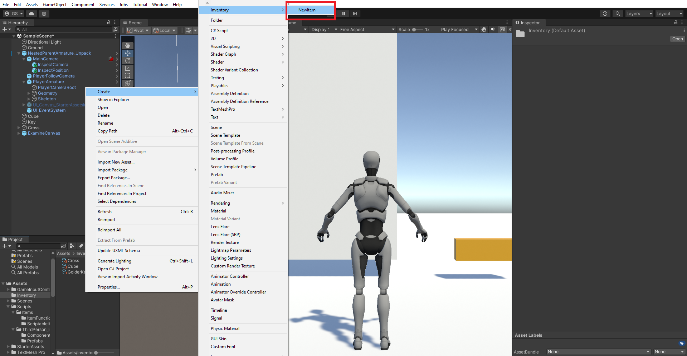
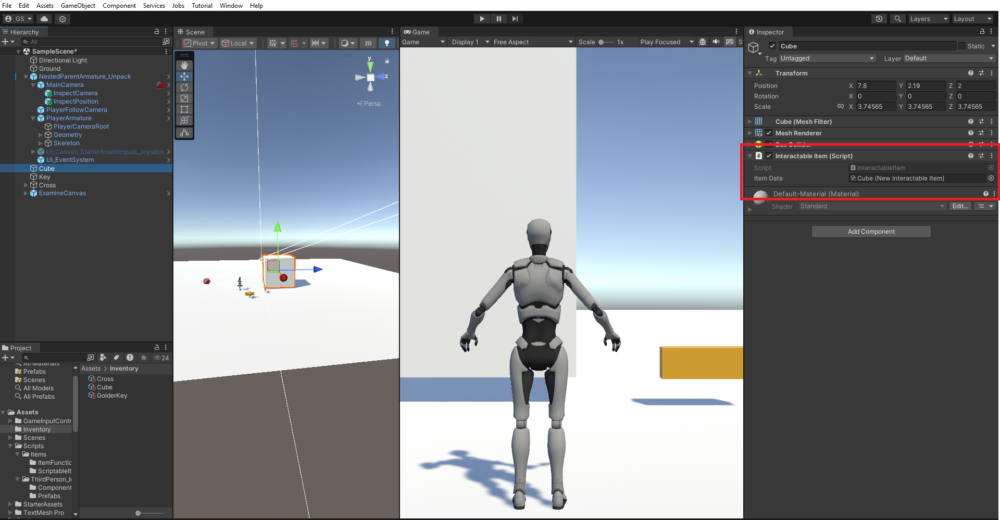
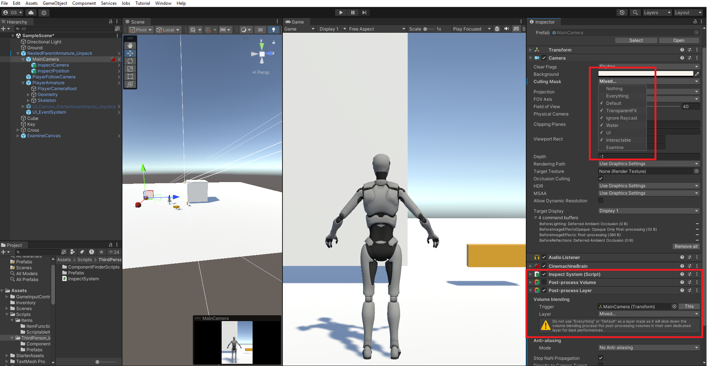
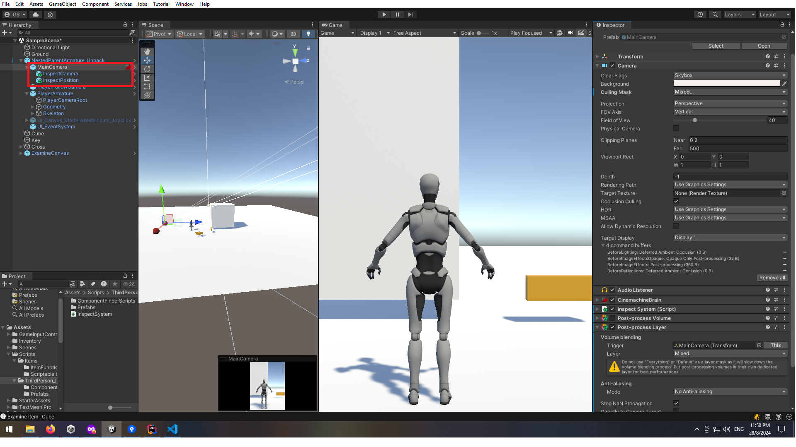
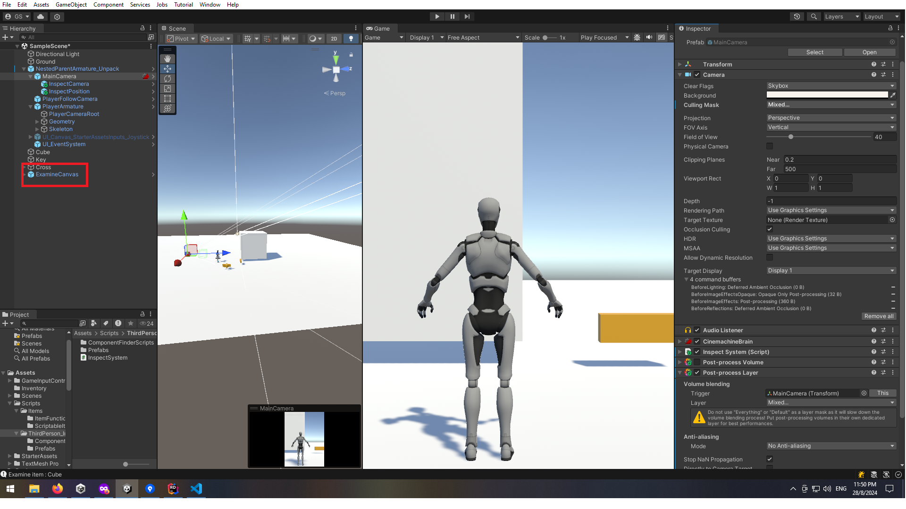
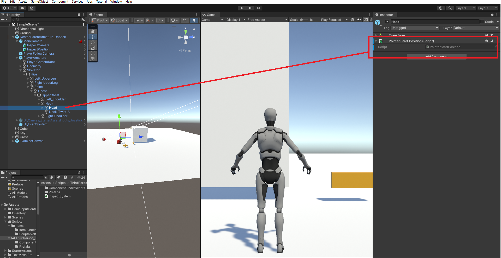

# Unity Item Examination System
A 3D item examination system inspired by the mechanics found in the Resident Evil games. This system allows players to inspect items in a 3D space by rotating, zooming, and resetting their view. It provides an immersive way to interact with items in-game, adding depth to the gameplay experience.

# Features
- **Examine Items**: Press E to bring the item in front of the camera for close inspection.
- **Rotate Items**: Hold the left mouse button and drag to rotate the item in any direction.
- **Zoom In/Out**: Use the mouse wheel to zoom in or out on the item for a detailed view.
- **Reset View**: Reset the item's position and orientation to the default view.
- **Exit Examination**: Exit the examination mode by pressing the designated key.

# Dependencies
This project uses the following Unity packages:

- **Starter Third Person Controller**: Provides basic third-person movement and camera control.
- **Post-Processing Stack**: Enhances the visual quality of the game with effects like bloom, depth of field, color grading, and more.
- **TextMeshPro (TMPro)**: Used for rendering high-quality text within the UI.

Ensure these packages are installed in your Unity project before integrating the item examination system.

# Installation

Clone the repository:

```bash
    git clone https://github.com/yourusername/item-examination-system.git
```
Basically you will need only the Scripts folder.

- **Add Two New Layer** :
Add 2 Layers with the name **Interactable** and **Examine**

- **Create a Scriptable Item** :
In your project, right-click in the Project window and navigate to **Create -> Inventory -> NewItem**. This will create a new ScriptableObject that holds the item's data (e.g., name, description, properties).




- **Attach the InteractableItem Script** :
Select the GameObject that you want to make examinable.
Attach the **InteractableItem** script to the GameObject.
Assign the *NewItem* you created to the InteractableItem script on the GameObject.



- **Add the Post-Processing Components** :
  - Select the MainCamera in your scene and attach the **InspectSystem** script. 
  - Add a Post-process Layer and Volume component to the MainCamera.
  - Add New Profile in the Volume component and add a Depth of Field with 0.1 Focus Distance.
  - Disable the Volume component.
  - Uncheck the *Examine* layer in the Culling Mask of the MainCamera and from the Post-process Layer.
  - 


- **Add the Prefabs**:
  -  Drag and drop the **InspectPosition** and **InspectCamera** prefabs from the Prefab folder as children of the MainCamera.
  -  


- **Add the Examine UI** :
  - Drag and drop the **ExamineUI** prefab from the Prefab folder into your scene.
  - 


- **Setup the RayCast Start Position** :
    - Attach the **PointerStartPosition** where the RayCast should start (e.g., at the player head for example ).
    - This setup will be used to determine if the player is looking at an interactable object.
    - 


- ***The GameObject is Now Examinable***:

The selected GameObject can now be examined in the game and will display the associated item data.

# Contributing

If you'd like to contribute to this project:

    Fork the repository.
    Create a new branch for your feature or bugfix.
    Commit your changes and push them to your fork.
    Submit a pull request detailing your changes.

# License

This project is licensed under the MIT License. See the [LICENSE](LICENSE.md) file for details.

## Acknowledgements
Inspired by the item examination mechanics from the Resident Evil series.


## 🚀 About Me
My name is John and i'm a junior software engineer thats like to work with unity.
**Lets Create!!!**


## 🔗 Links
[](https://www.linkedin.com/in/giannis-sakkas-a67587260/)
